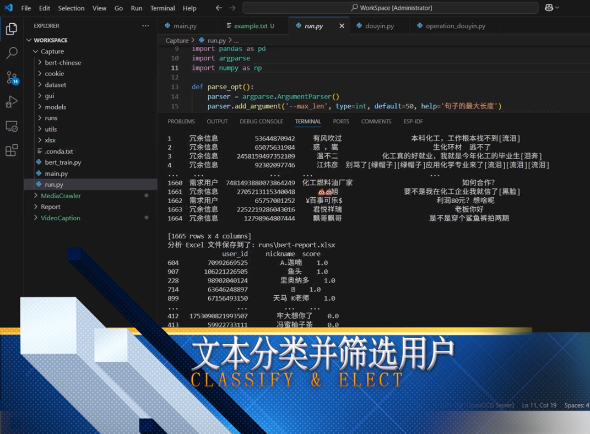

# B站 API + BERT 文本分类
bilibili 视频信息个人收集用项目（用于自动整理评论，不可用于非法用途！）



### 安装教程

```
pip install -r requirements.txt
```

### 爬虫使用说明

修改你需要访问的网址, 默认在 xlsx\input\bilibili_input.xlsx 内

```
# 使用默认参数即可
python main.py
```

###  $` BERT `$  使用说明

准备好训练数据到 dataset\aim\sampled_label.txt, 根据自己的需求进行修改, 训练过程难度较大

```
冗余信息	老板需要根本传感器吗
冗余信息	佩服 那你你什么时候会真生气
冗余信息	必须实名毛遂自荐一下！我们是深圳大深传感科技有限公司，汇聚了来自日本欧姆龙公司的研发技术精英，专注光
冗余信息	电控系统中空占比的CEO，非它莫属！
冗余信息	动物实验舱是一种为实验动物提供精确控制生存环境的设备，它在生命科学研究中扮演着至关重要的角色。通过模
冗余信息	是炜盛的MQ-5可燃气体传感器[呲牙]
需求用户	模块和传感器搜索什么
冗余信息	创新的灯塔
需求用户	大哥，你用啥烟雾啊？我这个MQ-2对打火机气还行，对于香烟烟雾简直就是呆子
冗余信息	[赞][赞][赞]
需求用户	请教一下，1ms内产生的10KG左右的压力，该选哪种类型的压力传感器，要求形变范围很小
需求用户	那如何量化指标输出烟雾浓度呢
冗余信息	如果想就业然后学院工程性不强，直接跑路。读博走学术挺不错的
需求用户	气味源可以精确定位吗？
```

开始训练 $` BERT `$ 模型, 这一部分需要一个较好的设备, 超参数需要自己根据数据集进行动态调整

```
# 训练 50 轮, 每批次 32 条数据, 最终分类数为 2, 使用训练集 dataset\aim\sampled_label.txt, 使用预训练参数 bert-chinese
python bert_train.py --epoch 50 --batch_size 32 --num_labels 2 --dataset dataset\aim\sampled_label.txt --pretraind_path bert-chinese
```

然后就慢慢炼自己想要的丹

### 用户分类

```
python run.py
```

本质就是使用 $` BERT `$ 进行文本分类, 根据自己的需求进行修改
